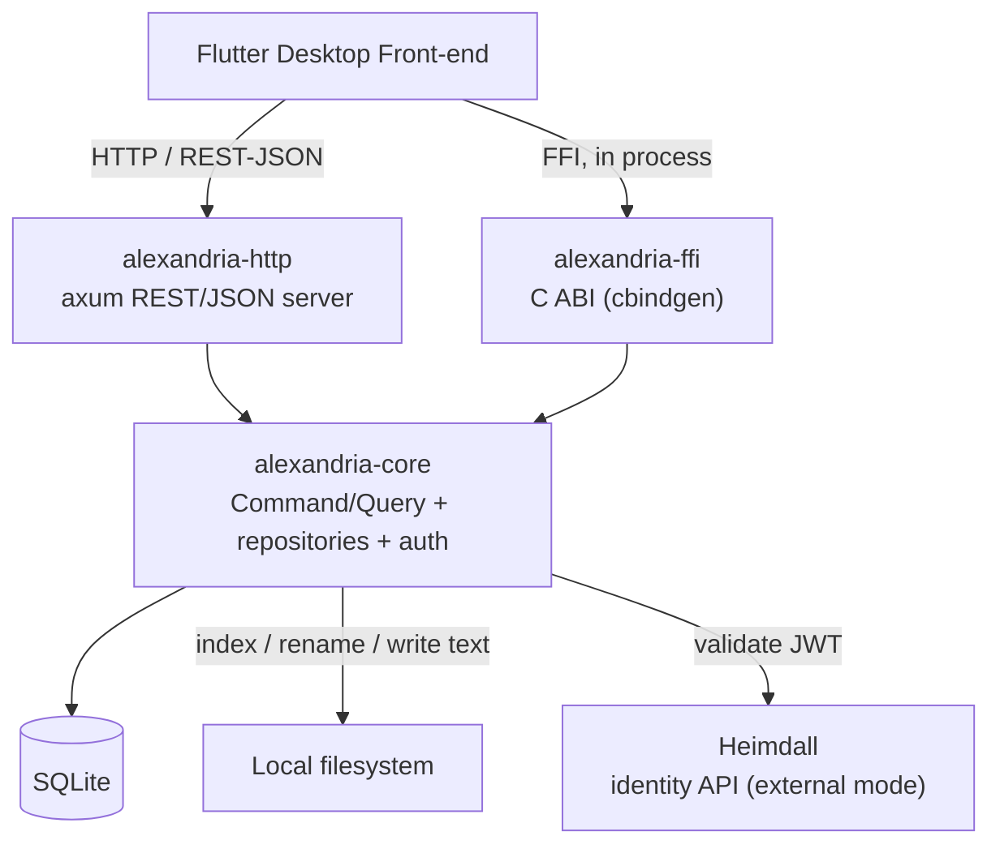
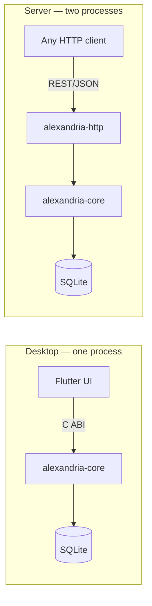
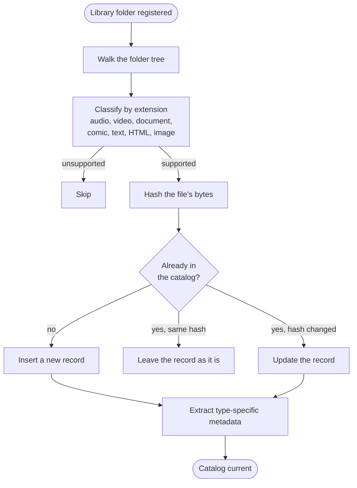
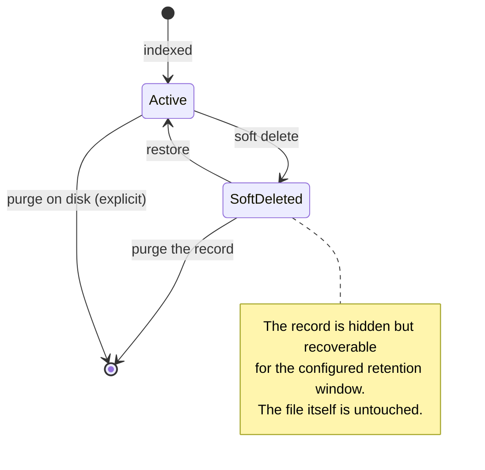

## One core, two transports

Alexandria's domain logic lives in a single Rust library. Two thin transport
layers sit on top of it: an HTTP REST/JSON server and a C ABI. Because both
call the same handlers, the two surfaces cannot drift apart.

`alexandria-core` follows a Command/Query baseline. Repository and auth-service
**traits** are what make its handlers unit-testable; `alexandria-http` and
`alexandria-ffi` add transport and nothing else.

## Who checks the credentials

Exactly one authentication mode is active at runtime.

**Local mode** is what the desktop application uses. Alexandria owns the single
account itself: registration, login, and recovery through single-use codes, with
nothing else involved.

**External mode** hands that job to
[Heimdall](https://github.com/artur-rios/heimdall-api), the identity API this
project runs alongside, in which Alexandria is registered as an application
inside a scope. The client logs in against Heimdall directly — completing
two-factor there if Heimdall asks for it — and then presents the JWT it gets
back to Alexandria as a bearer token. Alexandria only validates that token and
the scope it carries; it never sees a password, proxies no login, and gains no
endpoints of its own.

Heimdall's own documentation — its overview, architecture and sequence
diagrams, API reference, and requirements — is at
[artur-rios.github.io/heimdall-api](https://artur-rios.github.io/heimdall-api/).

## Two ways to deploy it

The same core supports two very different shapes. The desktop application uses
the first.

In desktop mode there is no network hop between the interface and its data, and
nothing to start, stop, or configure separately. That is why installing
Alexandria installs one thing — see
[Installation]().

Server mode exists for any client in any language that would rather speak HTTP.
It is not what the desktop application uses, and it has no packaged release.

## How a file gets indexed

Re-scanning runs the same pipeline. The content hash is what lets a re-scan
tell a changed file from an unchanged one without trusting timestamps.

## The deletion lifecycle

Nothing leaves your disk by accident. Deleting from the catalog and deleting
from disk are two separate operations, and the second is always explicit.

A soft delete hides the record and leaves the file alone. Purging the record
removes it from the catalog and still leaves the file alone. Purging on disk is
the only operation that removes the file itself, and it is a separate action
with its own confirmation.

## Where the detail lives

This page is a map, not a specification. The normative detail is in the code
repositories:

- [System Requirements Document](https://github.com/artur-rios/alexandria-api/blob/main/docs/requirements/System%20Requirements%20Document.md)
  — the functional and non-functional requirements, the data model, and the
  traceability matrix.
- [Use Case Specification Document](https://github.com/artur-rios/alexandria-api/blob/main/docs/requirements/Use%20Case%20Specification%20Document.md)
  — every use case, its flows, and its alternatives.
- [Business Rules](https://github.com/artur-rios/alexandria-api/blob/main/docs/initial/Business%20Rules.md)
  — the domain entities and the rules that govern them.

The [Repositories]() page lists the rest.
