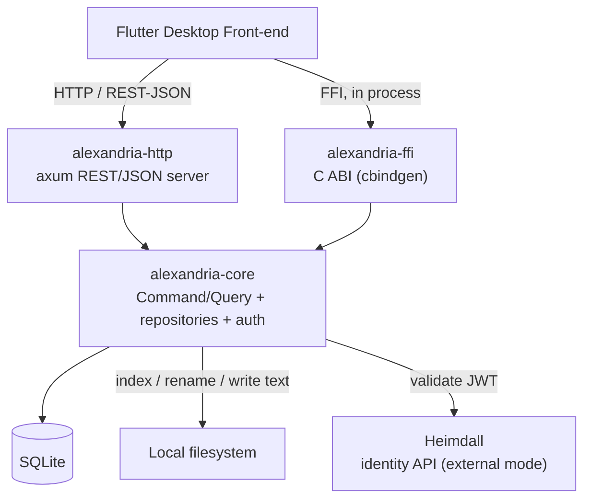
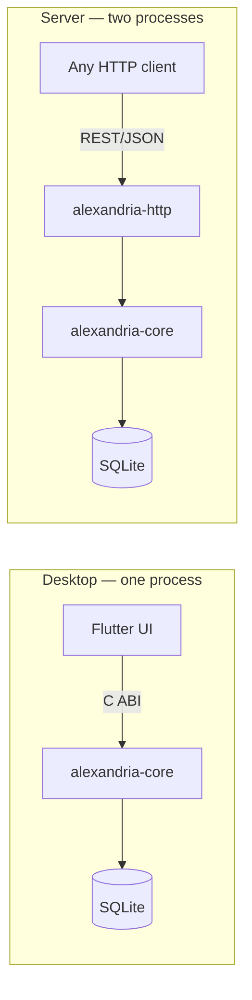
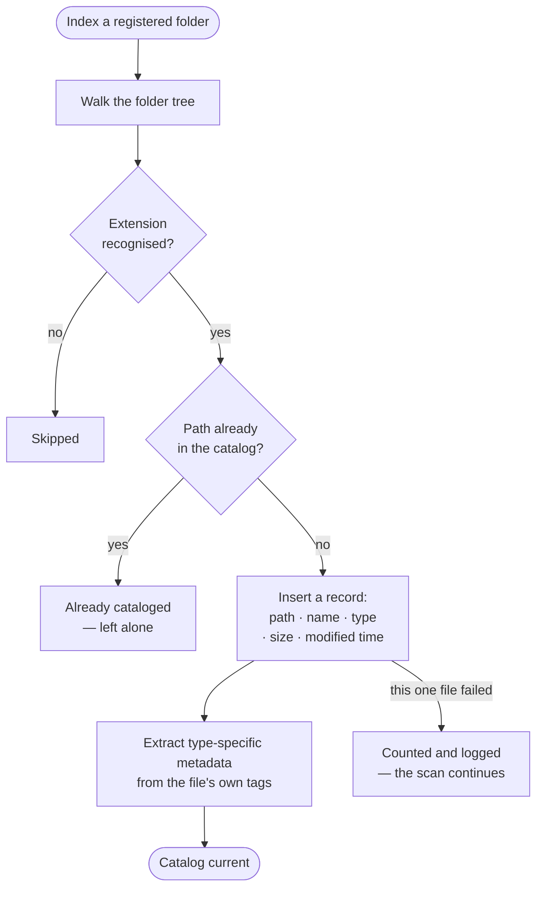
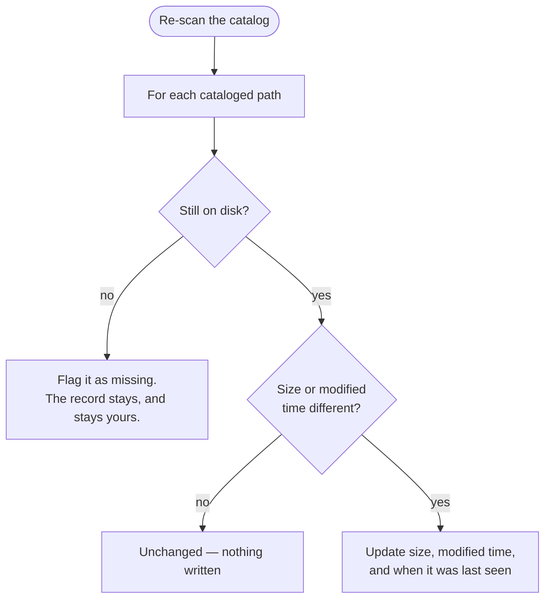
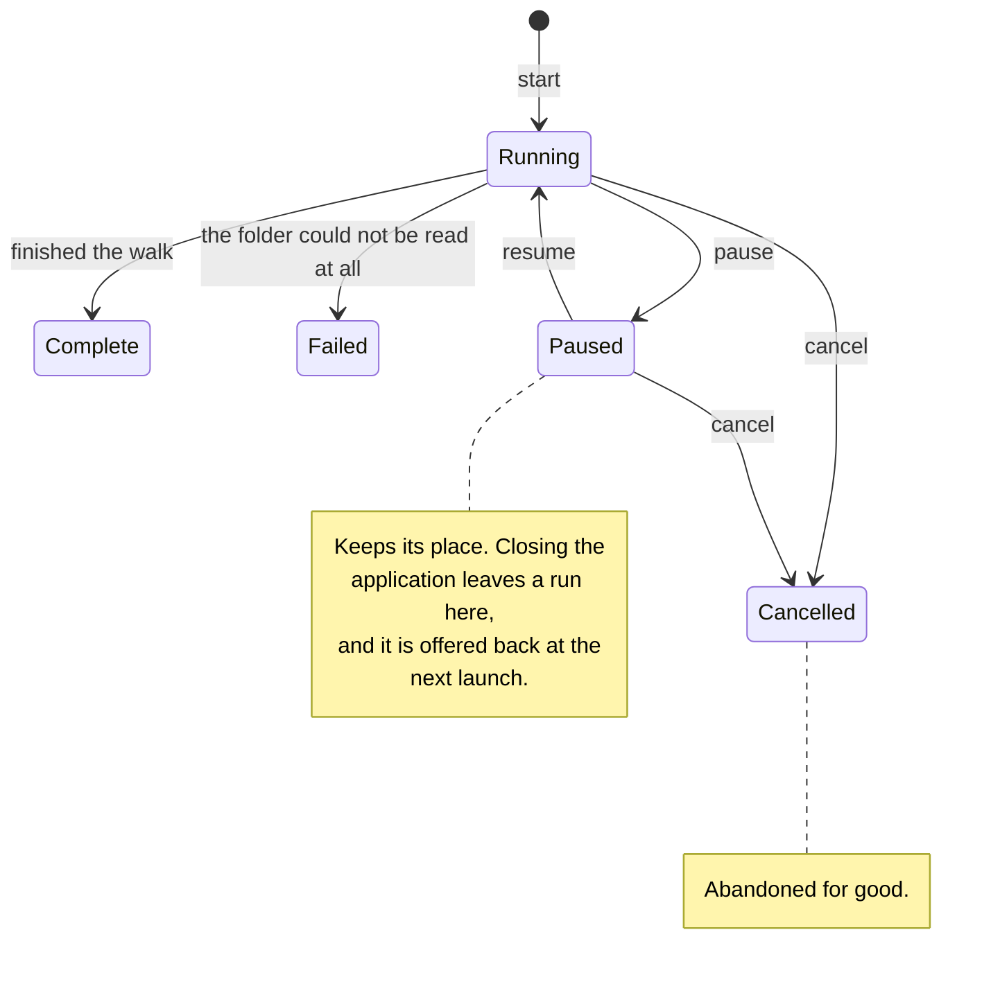
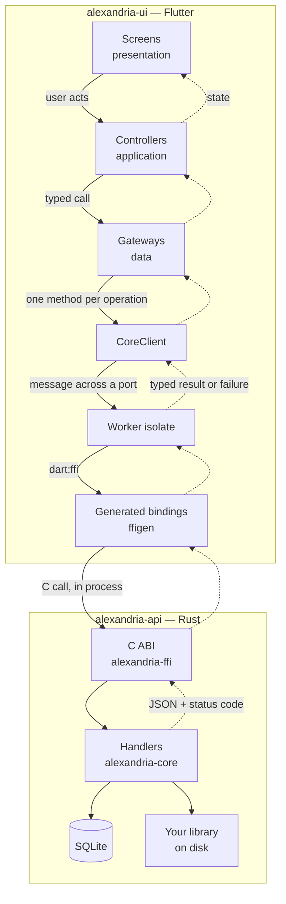
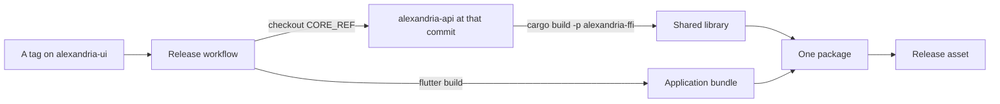
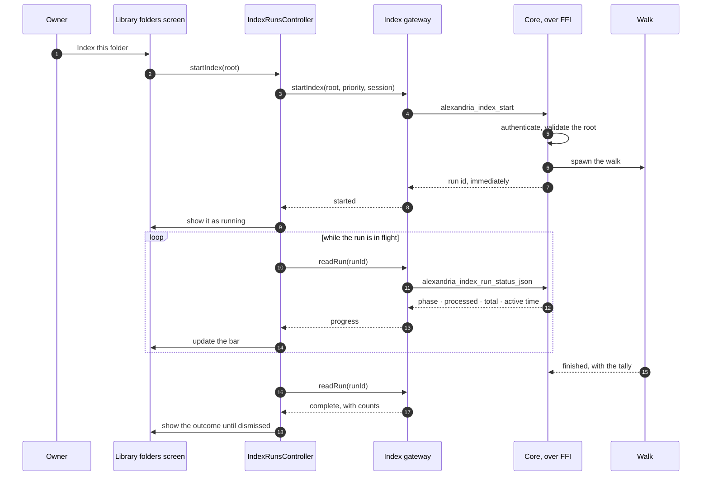
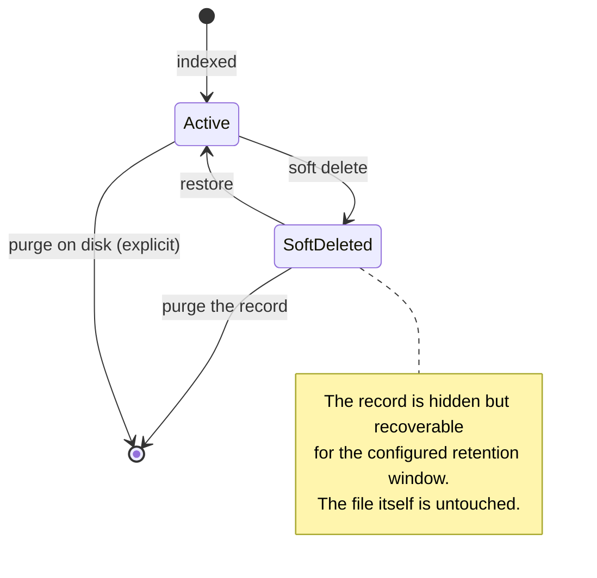

## One core, two transports

Alexandria's domain logic lives in a single Rust library. Two thin transport
layers sit on top of it: an HTTP REST/JSON server and a C ABI. Because both
call the same handlers, the two surfaces cannot drift apart.

`alexandria-core` follows a Command/Query baseline. Repository and auth-service
**traits** are what make its handlers unit-testable; `alexandria-http` and
`alexandria-ffi` add transport and nothing else.

## Who checks the credentials

Exactly one authentication mode is active at runtime.

**Local mode** is what the desktop application uses. Alexandria owns the single
account itself: registration, login, and recovery through single-use codes, with
nothing else involved.

**External mode** hands that job to
[Heimdall](https://github.com/artur-rios/heimdall-api), the identity API this
project runs alongside, in which Alexandria is registered as an application
inside a scope. The client logs in against Heimdall directly — completing
two-factor there if Heimdall asks for it — and then presents the JWT it gets
back to Alexandria as a bearer token. Alexandria only validates that token and
the scope it carries; it never sees a password, proxies no login, and gains no
endpoints of its own.

Heimdall's own documentation — its overview, architecture and sequence
diagrams, API reference, and requirements — is at
[artur-rios.github.io/heimdall-api](https://artur-rios.github.io/heimdall-api/).

## Two ways to deploy it

The same core supports two very different shapes. The desktop application uses
the first.

In desktop mode there is no network hop between the interface and its data, and
nothing to start, stop, or configure separately. That is why installing
Alexandria installs one thing — see
[Installation]().

Server mode exists for any client in any language that would rather speak HTTP.
It is not what the desktop application uses, and it has no packaged release.

## How a file gets indexed

Indexing **never reads a file's bytes to identify it**. It reads the size and
modification time that the directory listing already carries, and that pair is
what a re-scan compares. This is the single most important thing to know about
the pipeline, because the cost follows from it: a scan's duration is set by how
*many* files you have, not by how *big* they are.

Metadata extraction runs **only at first index**, which is what guarantees a
re-scan can never overwrite something you edited yourself.

### What a re-scan does

A re-scan visits every path already in the catalog. It discovers nothing new —
that is what indexing a folder is for — and it compares the stat pair.

A missing file is **flagged, never deleted**. Deleting is always something you
ask for.

### Following a scan while it runs

A large library takes a while, so a scan is a **run** you can watch and control
rather than something you start and hope about.

A run reports how far along it is, and can be paced: start it at **low**
priority — or pause and resume it at low priority — to keep the application
responsive while a big scan works through in the background. Nothing ever
resumes by itself.

A single unreadable file is counted and skipped; it never abandons the rest of
the scan.

## How the front-end and the core fit together

The desktop application and the core are two repositories and one program. This
is the seam between them, in the direction a call actually travels.

Three properties of that seam are worth stating, because they are what keep the
two repositories from drifting:

**Nothing above the data layer touches `dart:ffi`.** Screens and controllers see
typed domain objects and typed failures. An analyzer rule in the front-end's own
lint package enforces it, and a test suite proves the rule fires by running the
analyzer against deliberately-violating fixtures.

**Every core call runs on a worker isolate.** Indexing walks a filesystem and
listing the catalog serializes it all to JSON; either on the interface thread is
a frozen window. One long-lived isolate, not one per call.

**The C header is generated, vendored, and checked.** The core's build produces
the header with `cbindgen`; the front-end vendors a copy and generates its Dart
bindings from it with `ffigen`. CI compares the vendored copy against the core's
and fails on any difference, so a core signature change cannot land quietly on
one side.

### Which core the application is built against

The front-end pins the core to an exact commit — `CORE_REF`, in both its CI and
its release workflow, and the two must agree or the build stops.

Pinned to a commit rather than tracking a branch, so that moving to a newer core
is a deliberate act with the header re-vendored and the bindings regenerated in
the same change. It also means two builds of the same tag ship the same core.

### A call from end to end

Starting a scan, which is the operation with the most moving parts, and the one
where the split between "answer now" and "work for minutes" is visible.

The core publishes a status to be **asked for**, not a callback, so the
application polls while something is in flight and stops when nothing is. That
is also what lets a scan outlive the application: the run belongs to the core,
so its outcome is waiting to be read at the next launch rather than lost.

Pause, resume, and cancel travel the same path in the same direction — the
application asks, the core records, and the next reading reflects it.

## The deletion lifecycle

Nothing leaves your disk by accident. Deleting from the catalog and deleting
from disk are two separate operations, and the second is always explicit.

A soft delete hides the record and leaves the file alone. Purging the record
removes it from the catalog and still leaves the file alone. Purging on disk is
the only operation that removes the file itself, and it is a separate action
with its own confirmation.

## Where the detail lives

This page is a map, not a specification. The normative detail is in the code
repositories:

- [System Requirements Document](https://github.com/artur-rios/alexandria-api/blob/main/docs/requirements/System%20Requirements%20Document.md)
  — the functional and non-functional requirements, the data model, and the
  traceability matrix.
- [Use Case Specification Document](https://github.com/artur-rios/alexandria-api/blob/main/docs/requirements/Use%20Case%20Specification%20Document.md)
  — every use case, its flows, and its alternatives.
- [Business Rules](https://github.com/artur-rios/alexandria-api/blob/main/docs/initial/Business%20Rules.md)
  — the domain entities and the rules that govern them.

The [Repositories]() page lists the rest.
